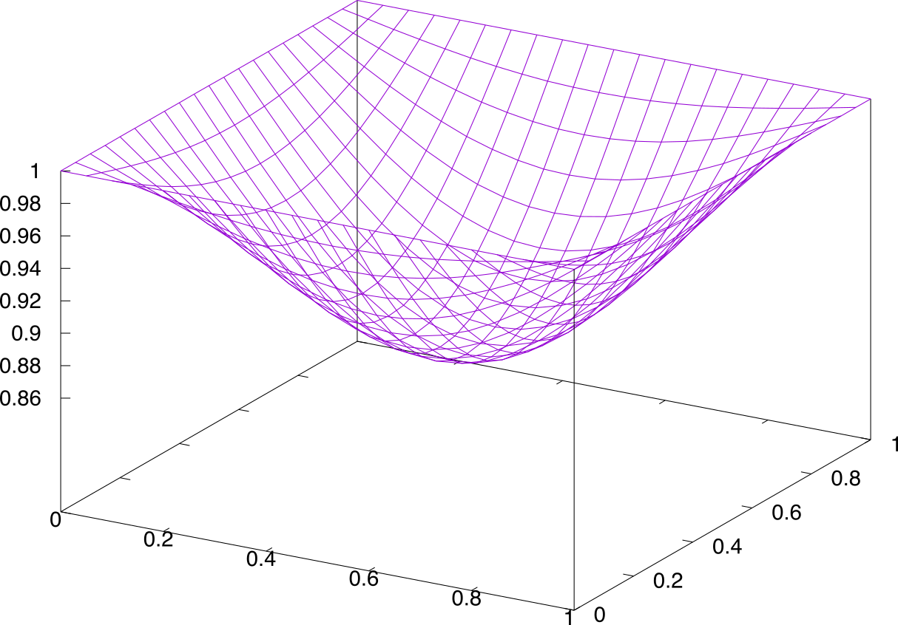
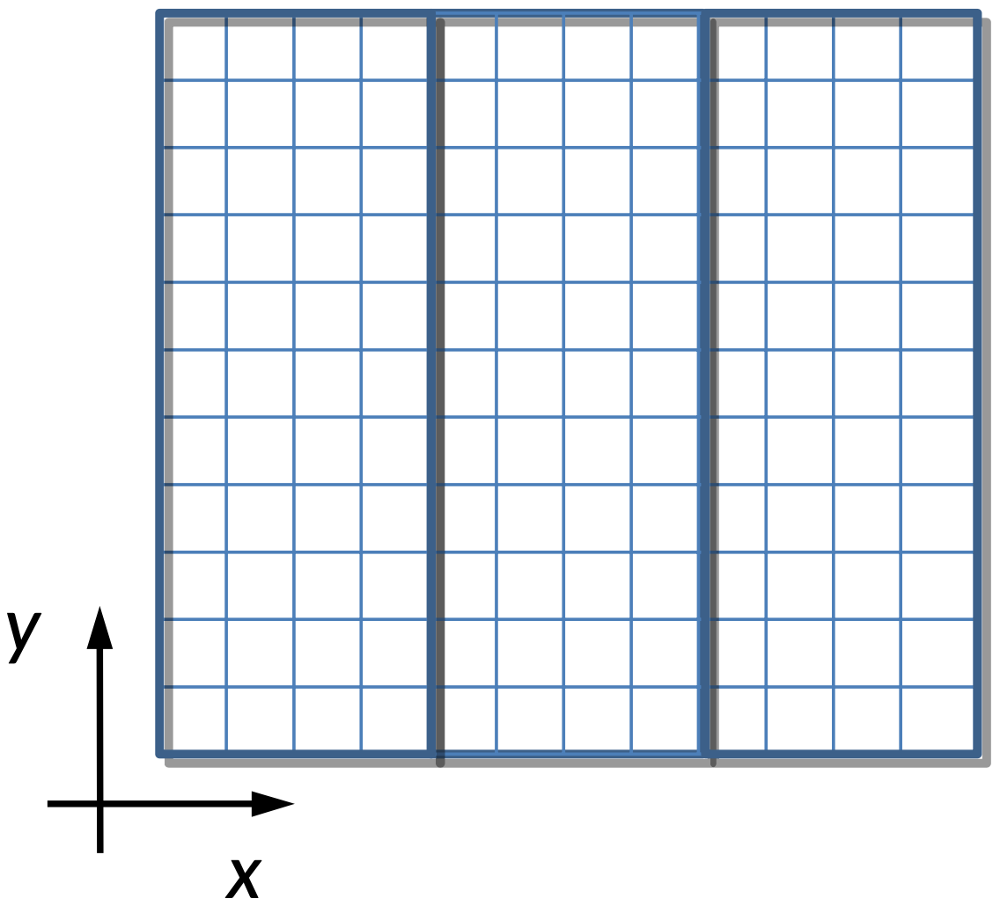

Parallelization of the diffusion problem
========================================

Parallelized Fortran code, using the MPI API, that solves the unsteady two-dimensional [diffusion equation](https://scipython.com/book/chapter-7-matplotlib/examples/the-two-dimensional-diffusion-equation/) in a m x n domain, using a simple finite difference scheme.

## Build
Two makefiles are included: one for the Sun Studio 12 compiler (tested with ver. 5), and another for GFortran.

Just run `make` (sun) or `make --file=makefile_gnu` (GFortran)

This creates a main binary called `bin`, which may be executed with `mpirun -np 8 ./bin` (e.g. for using 8 processors).

### The code
- Discretizes the problem using 2nd finite-differences for the Laplacian.
- Creates a mesh of size (m x n).
- Decomposes the mesh into subset layers (according to number of procs) with ghost layers:

- Integrates the solution in time using explicit Euler time integration.

Domains specification etc. are set in the `inputfile.txt` file.
